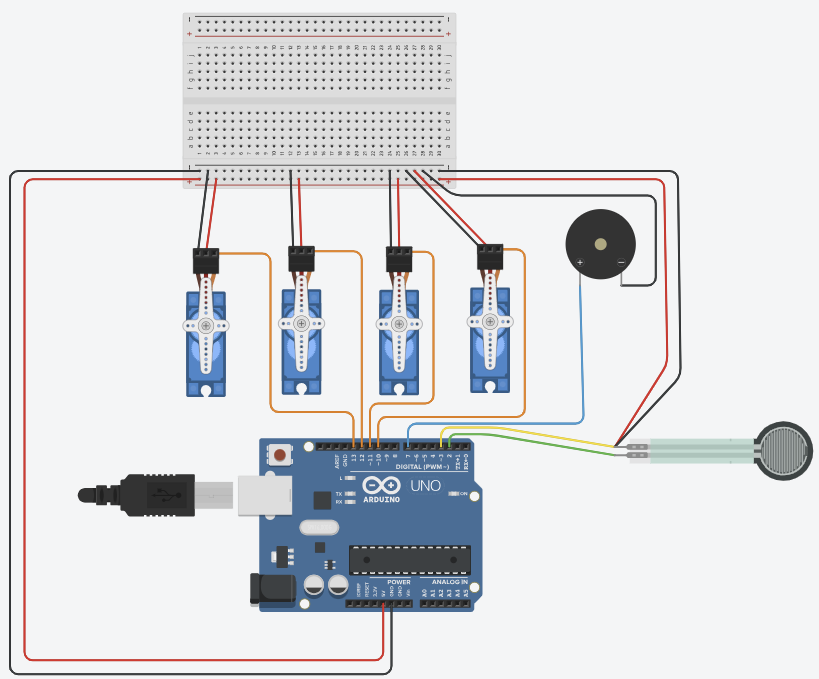

# :pill: DispenseX
A monorepo containing three applications: Arduino, Api & Platform.

## Table of Contents
- [Overview](#overview)
- [Folder Structure](#folder-structure)
- [Applications](#applications)
  - [Arduino](#arduino)
  - [API](#api)
  - [Platform](#platform)
- [Getting Started](#getting-started)

## Overview
This monorepo consists of three individual products that communicate using an Api.

## Folder Structure
The monorepo is organized into three main folders:

:point_right: **Arduino**: Contains code related to the Arduino application. <br>
:point_right: **Api**: Holds the codebase for the Spring Boot powered API application. <br>
:point_right: **Platform**: Holds the codebase for the JavaFX powered user application.

## Getting Started
To start using DispenseX for yourself, you have to follow this setup guide, which will take you through the installation procedure for all 3 applications in this repository.

> :exclamation: Be aware that the machine that serves your Api **MUST** be connected to the same network as your Arduino!

### Arduino
The first step you have to take, is to build the circuit that is described in the image below. Make sure to check this twice, wrong configuration **WILL** cause issues.



The next step you have to take for Arduino to work properly, is to fill in your own networking credentials.
This can be done by executing the following command inside the Arduino directory:

```bash
cp secrets_example.h secrets.h
```

After you created the secrets.h file, you need to enter your own:
* SSID (The name of your network)
* Password (Password of your network)
* IP-address (The **PUBLIC** IP-address of your computer, **not localhost or 127.0.0.1!**)

### Api
Go to the `build.gradle` file in the Api folder, and sync your Gradle dependencies. This process installs all required libraries for the API to work properly.
After that, head to `src` > `main` > `java` > `oose2324` > `group5` > `dispenseX` > `Application` and click on the green arrow to run the API.

Head over to http://localhost:8080/ to interact with the Api.

### Platform
Go to the `build.gradle` file in the Platform folder, and sync your Gradle dependencies. This process installs all required libraries for Platform to work properly.
After that, head to `src` > `main` > `java` > `oose2324` > `group5` > `dispenseX` > `Platform` > `DispenseXMainStage` and click on the green arrow to run Platform.
